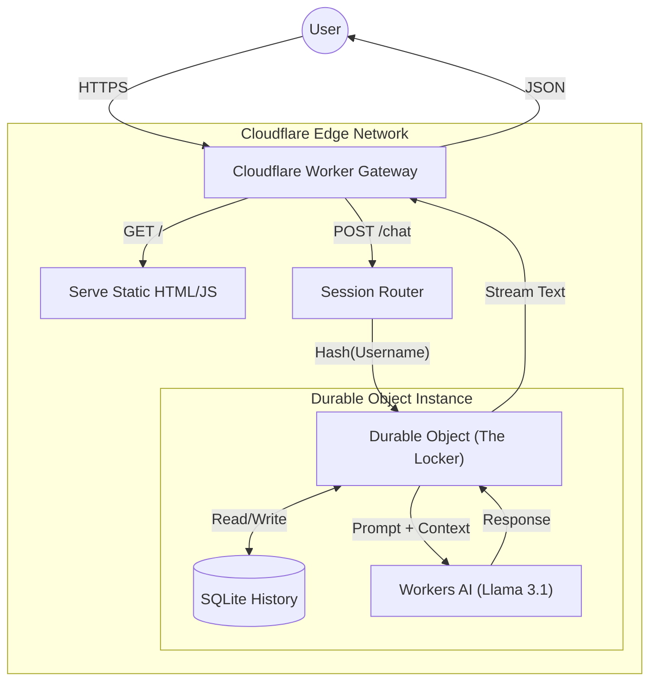

# 🧠 EdgeMind: State-Aware AI on Cloudflare

   

> **A distributed, stateful AI chat system running entirely on the Edge.** > _No external databases. No origin servers. Just code._

🔗 **[Launch Live Demo](https://cf_ai_edge-mind.devyalchemist.workers.dev)**

---

## 📖 Project Overview

**cf_ai_edge-mind** is a serverless application that solves the "stateless" problem of AI at the Edge.

Traditional serverless functions (like AWS Lambda or standard Workers) "forget" the user immediately after running. To fix this, developers usually connect them to slow, centralized databases (Postgres/Redis).

**This project eliminates that bottleneck.** By using **Cloudflare Durable Objects** with the new **SQLite backend**, we co-locate the user's chat history _directly_ with the compute node. This results in an AI that remembers context instantly, without network latency.

### 🎯 Key Features

- **⚡ Zero-Latency Memory:** State is stored in-memory/on-disk right next to the active Worker.
- **🔑 Identity-Based Sharding:** Uses a "Handle" system to route specific users to their specific memory vault (Durable Object), enabling cross-device consistency.
- **🧠 Local Llama Inference:** Runs `Meta Llama 3.1 8B` directly on Cloudflare Workers AI (Neural Engine).
- **🌍 Region-Aware:** The architecture automatically instantiates the "Chat Room" in the data center closest to the user.

---

## 🏗️ Architecture

The system uses a **Monolithic Worker Pattern** to unify the UI, API, and Database into a single deployable unit.

Data Flow

Auth: User enters a handle (e.g., devy).

Routing: The Worker hashes the handle to find the specific Durable Object ID for that user.

Context Loading: The Durable Object pulls the last 10 messages from its internal SQLite storage.

Inference: The Object sends the full context to Workers AI.

Persistence: The new response is saved atomically to storage.

## 🛠️ Technology Stack

| Component    | Technology            | Role                          |
| :----------- | :-------------------- | :---------------------------- |
| **Runtime**  | Cloudflare Workers    | The API Gateway & UI Server   |
| **Compute**  | Durable Objects       | The stateful "memory lockers" |
| **Storage**  | DO SQLite Backend     | High-performance persistence  |
| **AI Model** | Llama 3.1 8B Instruct | Natural Language Processing   |
| **Language** | JavaScript (ESM)      | Logic                         |
| **Tooling**  | Wrangler              | Deployment & Local Dev        |

## Getting Started

Follow these steps to deploy your own instance of cf_ai_edge-mind.

1. Clone & Install
   Bash

# Clone the repository

git clone [https://github.com/devyalchemist/cf_ai_edge-mind.git](https://github.com/devyalchemist/cf_ai_edge-mind.git)
cd cf_ai_edge-mind

# Install dependencies

npm install

2. Configure Cloudflare
   Ensure your wrangler.toml is set up for the Free Tier (SQLite backend).

Ini, TOML

# wrangler.toml

[ai]
binding = "AI"

[[durable_objects.bindings]]
name = "CHAT_HISTORY"
class_name = "ChatRoom"

[[migrations]]
tag = "v1"
new_sqlite_classes = ["ChatRoom"]

3. Run Locally (Hybrid)
   Since your laptop cannot run the Llama model, use --remote to tunnel AI requests to Cloudflare.

Bash

npx wrangler dev --remote

. Deploy to Edge
Bash

npx wrangler deploy

# 🧠 Engineering Decisions

Why Durable Objects?
I chose Durable Objects over an external Vector DB (like Pinecone) or Redis because of Data Locality. In a chat application, the "Read-Your-Writes" consistency is critical. Durable Objects guarantee that if a user sends a message, the very next read will include that message, eliminating the eventual consistency issues common in distributed systems.

# Why Llama 3.1 8B?

While Llama 3.3 (70B) offers higher intelligence, it incurs higher latency and timeout risks on the Free Tier. The 8B model provides the optimal balance of speed and reasoning capability for a real-time chat interface.

# 🔮 Future Roadmap

[ ] RAG Integration: Connect to Cloudflare Vectorize for long-term document recall.

[ ] Streaming: Implement TextEncoderStream for typewriter-style responses.

[ ] Secure Auth: Replace the handle system with Cloudflare Access (OAuth).

# Built by DevyAlchemist.
